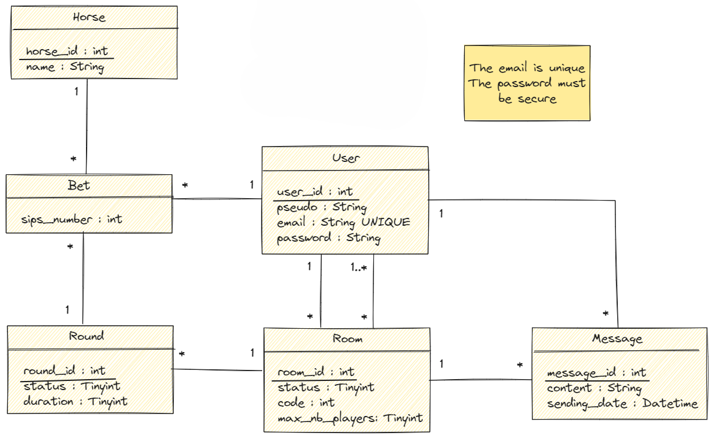
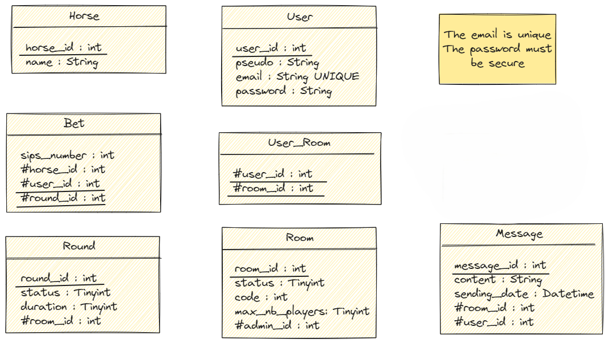

# PMU : un jeu en ligne ou local multijoueur

Découvrez une façon unique et divertissante de vivre l'excitation des paris hippiques avec notre jeu le PMU ! Surprenez vos amis lors de vos soirées avec ce jeu original qui mêle suspense, stratégie et convivialité. Plongez dans l'univers des courses de chevaux sans quitter votre salon. Pariez sur vos chevaux préférés, vibrez au rythme des résultats et profitez d'une expérience inoubliable. Avec des règles simples et une ambiance garantie, notre jeu est l'animation parfaite pour toutes vos soirées entre amis. Alors, qui aura le flair pour choisir le vainqueur ? Relevez le défi et passez des moments de pur plaisir avec le PMU !

Laissez-vous guider pour découvrir ce jeu de soirée incontournable en version digitale ! 

## Installation de l'API
### Récupérer le projet
Ouvrez un terminal de commande à l'endroit où vous souhaitez installer le jeu du PMU, puis exécutez :

`git clone https://github.com/Evahhhh/PMU.git`

`cd .\PMU\`

### Installer le projet
`npm i`

## Installation de la base de données
Tout d'abord vous aurez besoin de Docker, voici comment l'installer : https://docs.docker.com/get-docker/

Une fois installé, retournez sur votre terminal dans le dossier PMU et exécutez :

`docker-compose up -d --build`

Cela va créer *[ce fichier](/database/db.sqlite)* qui sera votre base de données.

Bravo ! Votre base de données sqlite3 est maintenant prête à être utilisée

*Remarque : Si après avoir supprimé le fichier db.sqlite vous souhaitez l'avoir à nouveau, il suffit de relancer le container docker avec la commande `docker start sqlite-container`*

## Lancer le projet
`npm run dev`

## Documentation
### Notre API
L'API est documenté grâce à Swagger sur la route /api/docs. Il est possible de directement tester l'API grâce à celle-ci. Toutes les erreurs possibles sont répertoriées.

### Base de données

*[Disponible ici](src/doc/database/UML_1.png)*

*[Disponible ici](src/doc/database/UML_2.png)*